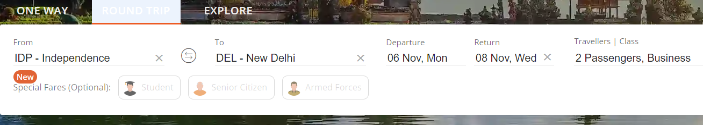
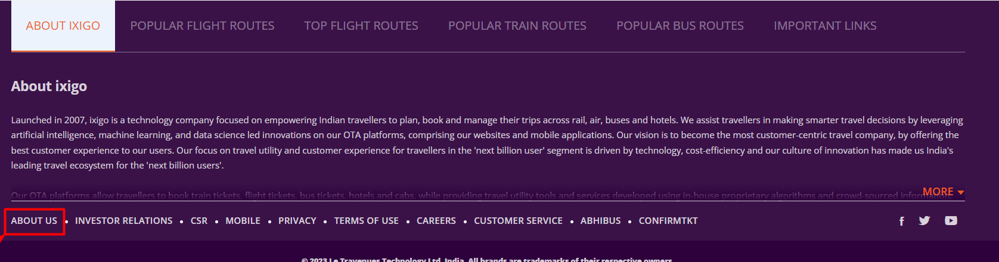

<!-- Auto Generated from Portal using Iamneo Portal Scrapper -->

### Project Question

URL: https://www.ixigo.com/

1. Build a Data Driven Automation framework using the above URL.

2. Utilize the utilities available in the framework to:

    - Perform Excel read for test data.
    - Create an extent report.
    - Create a screenshot to be used in the extent report.

3. Design at least 2 independent test cases in the framework.

4. Each test case must have a navigation of at least 2 pages.

5. Need to capture screenshots for the failed test cases.

6. Use all best practices for report, excel reading and screenshot capturing.

**Instructions:**

1. When you open the workspace, click "ACCEPT" in the lower-right corner of the REDHAT notification to enable import package suggestions while working on Selenium scripts.

2. Ensure that you do not change the existing main class file.

3. Common Maven Commands for Selenium:

    - To change to a specific directory: cd /path of your maven project
    - To run all test cases: mvn clean test
    - To change to a parent directory: cd ..

4. To view the running scripts,

    - Click on port 8081, and you'll be directed to a new window. In the URL bar of this new window, replace "8081" with "4444" to access the Selenium Grid.
    - Perform the same procedure again, but replace "8081" with "7900" for the VNC server page
    - To view the execution, click on the "connect" button on the VNC server page and enter the password "secret".

5. If you need to terminate an active session in the Selenium Grid, you can click on the "reset grid" button located next to the "reload ide" button.

6. To execute your test scripts, click Run Test Case.

7. To submit your code, click "Submit Project" and to end the Test by clicking "Submit Test", where you find a dialog box enter the text **"END"**.

Note: If any pop-up's occur use explicit wait until the element is visible.

#### Testcase1:

1.  Click on the "**Round Trip".**
2.  Locate the input field labelled as **“FROM”**.
3.  Input the city "IDP - Independence" from excel file and select "IDP - Independence"
4.  Locate the input field labelled as **“TO”**.
5.  Input the city "DEL - New Delhi" into the input field and select "DEL - New Delhi"
6.  Identify the input field labelled as "**Departure**." and select the departure date as "Nov-6-2023"
7.  Locate the input field labelled as "**Return**." and select the return date "Nov-8-2023"
8.  Click on the **"Travellers and Class"** section. Within this section, increase the value by 2 for Adults and also increase the value by 2 for Child from the default value. Then under the class section choose the **“Business”** option.
9.  Verify the return date contains "08 Nov" is displayed in the date picker.

#### Testcase2:

1.  Open the URL: https://www.ixigo.com/
2.  Click on "About Us" in the homepage footer section.

3. You will be redirected to a new tab, and verify the URL contains the keyword "about"

**Note: To see your reports, click on the surefire-output folder.**
